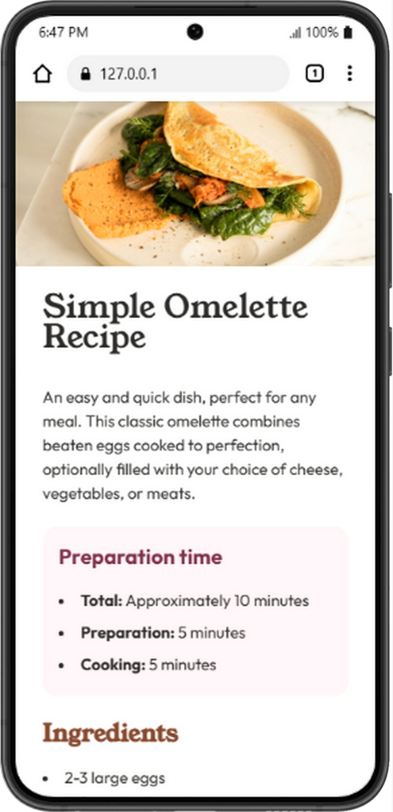

# Frontend Mentor - Recipe page solution

This is a solution to the [Recipe page challenge on Frontend Mentor](https://www.frontendmentor.io/challenges/recipe-page-KiTsR8QQKm). Frontend Mentor challenges help you improve your coding skills by building realistic projects. 

## Table of contents

- [Overview](#overview)
  - [The challenge](#the-challenge)
  - [Screenshot](#screenshot)
  - [Links](#links)
- [My process](#my-process)
  - [Built with](#built-with)
  - [What I learned](#what-i-learned)
  - [Continued development](#continued-development)
- [Author](#author)
- [Acknowledgments](#acknowledgments)

**Note: Delete this note and update the table of contents based on what sections you keep.**

## Overview

### Screenshot



### Links

- Solution URL: [Cee-C685](https://https://https://github.com/Cee-C685/Omelette-Recipe)
- Live Site URL: [Add live site URL here](https://your-live-site-url.com)

## My process

### Built with

- Semantic HTML5 markup
- CSS custom properties
- Flexbox
- Mobile-first workflow
- [Styled Components](https://styled-components.com/) - For styles

### What I learned
 Writing these out and providing code samples of areas you want to highlight is a great way to reinforce your own knowledge.


```html
<table><tbody>
              <tr class="table-row">
                <th>Calories</th>
                <td>277kcal</td>
              </tr>
              <tr>
                <th>Carbs</th>
                <td>0g</td>
              </tr>
              <tr>
                <th>Protein</th>
                <td>20g</td>
              </tr>
              <tr>
                <th>Fat</th>
                <td>22g</td>
              </tr>
            </tbody>
          </table>
```
```css
table {
  border-collapse: collapse;
}
```
### Continued development
 These could be concepts you're still not completely comfortable with or techniques you found useful that you want to refine and perfect.

## Author

- Frontend Mentor - [Cecilia](https://www.frontendmentor.io/profile/Cee-C685)
